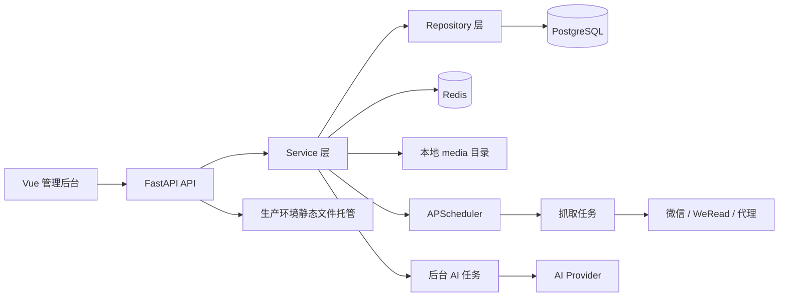
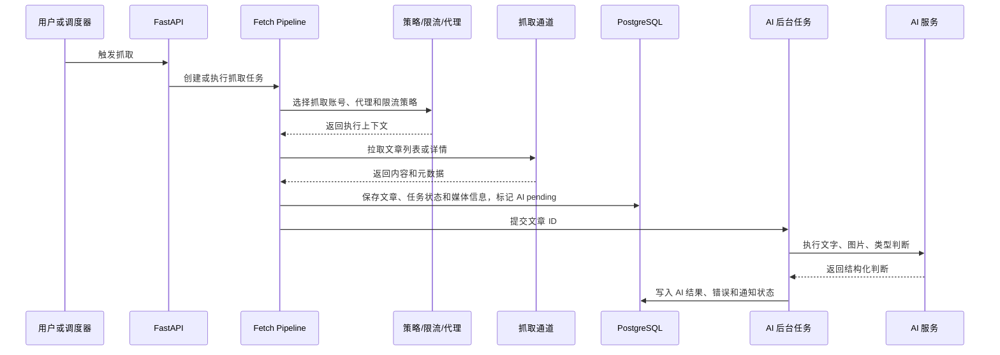

# Just—We 技术设计文档

本文面向希望理解、部署、二次开发或审查 Just—We 的用户和开发者。读完本文后，你应该能够回答三个问题：

1. 这个项目如何运行。
2. 每个核心功能为什么这样设计。
3. 为什么选择当前技术栈和工程边界。

## 1. 项目定位

Just—We 是一个微信公众号内容监测系统。它的目标不是提供一个任意网站通用爬虫，而是围绕“公众号内容持续监测”这个业务场景建立一条稳定链路：

```text
用户登录
  -> 配置抓取账号和代理
  -> 添加要监测的公众号
  -> 调度任务按策略抓取文章
  -> 保存文章和图片
  -> 后台执行 AI 分析
  -> 通过后台、导出和 Feed 消费结果
  -> 通过日志、通知、健康检查处理异常
```

微信公众号内容监测有几个明显特点：

- 抓取通道不稳定，需要账号、代理、冷却、重试和降级能力。
- 文章不只是文本，还包含富文本、封面、图片和原始元数据。
- 同一个系统既要服务业务用户，也要服务运维排障。
- 外部能力可能缺失，例如真实 AI key、WeRead 平台或代理服务不可用，因此系统必须能展示配置、保存状态并给出可理解的失败路径。

因此项目采用“业务工作台 + 后端任务系统 + 可观测运行状态”的结构，而不是只写一个脚本式采集器。

## 2. 总体架构



主要目录：

```text
app/api/             HTTP API 路由，负责请求、权限和响应模型
app/services/        业务服务，负责编排规则和外部调用
app/repositories/    数据访问层，封装 SQLAlchemy 查询
app/models/          SQLAlchemy ORM 模型
app/schemas/         Pydantic 请求和响应结构
app/tasks/           可调度任务入口
app/core/            配置、数据库、依赖、Redis、异常处理
frontend/src/        Vue 3 管理后台
alembic/             数据库迁移
docs/                部署、配置和设计文档
```

### 为什么这样分层

API 层只处理 HTTP 语义，例如认证、权限、参数校验和状态码。真正的业务规则放在 service 层，数据库查询放在 repository 层。这样做有三个好处：

- 权限和业务逻辑不会散落在前端页面或路由函数里。
- 测试可以直接调用 service 或 repository，减少 HTTP 细节干扰。
- 后续如果增加 CLI、后台任务或其他入口，可以复用 service 层。

项目没有引入更重的领域框架，因为当前业务复杂度主要在“采集链路和状态管理”，不是大型分布式微服务。保持 FastAPI + service/repository 足够清晰，也降低了自托管用户的部署成本。

## 3. 运行时生命周期

FastAPI 应用入口在 `app/main.py`。启动时会执行：

1. 初始化数据库表。
2. 创建媒体目录。
3. 启动 APScheduler。
4. 确保默认管理员存在。
5. 读取活跃监测账号，加载定时抓取任务。
6. 注册抓取账号健康检查任务。

关闭时会停止 scheduler，并关闭数据库和 Redis 连接。

这种生命周期设计保证了应用容器重启后可以自动恢复运行状态。数据库保存监测对象、策略和任务记录；启动时重新加载活跃监测对象即可恢复定时调度。

## 4. 数据模型设计

### 4.1 用户与权限

用户模型是 `users`，核心字段包括：

- `email`
- `hashed_password`
- `role`
- `is_active`
- `is_superuser`
- `aggregate_feed_token`

角色分为：

- `admin`：系统管理、用户管理、配置管理、日志和权重配置。
- `operator`：日常采集和内容管理。
- `viewer`：只读查看。

为什么使用角色而不是只用 `is_superuser`：

- 公众号监测系统有明显的操作人员和只读人员差异。
- 后续可以在不改变用户表结构的情况下扩展权限判断。
- 前端路由也能直接根据 `role` 做管理员页面保护。

`aggregate_feed_token` 让用户可以通过 token 获取自己的聚合 Feed，避免把 Feed 直接绑定登录态。Feed 场景常被 RSS 阅读器使用，它们通常不能处理交互式登录。

### 4.2 抓取账号

抓取账号模型是 `collector_accounts`。它表示“用于抓取内容的凭据或会话”，而不是被监测的公众号。

关键字段：

- `owner_user_id`：账号归属用户。
- `account_type`：`weread` 或 `mp_admin`。
- `credentials`：保存会话或接口凭据。
- `status`：是否启用、过期或错误。
- `health_status`：健康、受限、过期或无效。
- `risk_status`：正常、冷却或阻塞。
- `cool_until`：失败后的冷却截止时间。
- `login_proxy_id`：登录会话绑定代理。
- `metadata_json`：保留通道相关扩展信息。

为什么抓取账号和监测公众号分开：

- 一个抓取账号可以服务多个监测公众号。
- 一个监测公众号可以根据策略选择不同抓取通道。
- 抓取账号有登录、过期、冷却和代理绑定等运行状态；监测公众号有 Tier、分数和发布时间等业务状态。两者生命周期不同，合并会导致模型混乱。

### 4.3 监测公众号

监测公众号模型是 `monitored_accounts`。它表示“用户希望持续观察的公众号”。

关键字段：

- `owner_user_id`
- `biz`
- `fakeid`
- `feed_token`
- `name`
- `source_url`
- `current_tier`
- `composite_score`
- `primary_fetch_mode`
- `fallback_fetch_mode`
- `status`
- `next_scheduled_at`
- `update_history`
- `ai_relevance_history`
- `strategy_config`

唯一约束是 `owner_user_id + biz`。这意味着不同用户可以监测同一个公众号，但同一个用户不能重复添加同一个 `biz`。这样设计兼顾了多用户隔离和数据去重。

`current_tier` 和 `composite_score` 用于动态决定抓取频率。高价值、高活跃、近期相关度更高的公众号应被更频繁地检查；低价值或长期无变化的公众号可以降低频率，减少账号和代理压力。

### 4.4 文章

文章模型是 `articles`，保存抓取结果和 AI 分析结果。

核心字段：

- `monitored_account_id`
- `title`
- `content`
- `content_html`
- `raw_content`
- `images`
- `original_images`
- `cover_image`
- `url`
- `published_at`
- `content_fingerprint`
- `source_payload`
- `ai_text_analysis`
- `ai_image_analysis`
- `ai_type_judgment`
- `ai_combined_analysis`
- `ai_target_match`
- `ai_analysis_status`
- `ai_analysis_error`

为什么同时保存清洗内容、富文本和原始内容：

- `content` 适合搜索、摘要和 AI 文本分析。
- `content_html` 适合后台详情页和 Feed 输出。
- `raw_content` 和 `source_payload` 方便排查解析错误和通道差异。

为什么保存 `content_fingerprint`：

- 微信文章可能通过不同入口重复被发现。
- URL 有时带跟踪参数或跳转参数。
- 内容指纹能帮助识别重复内容，减少重复入库和重复分析。

### 4.5 代理

代理模型分为 `proxies` 和 `proxy_service_bindings`。

`proxies` 保存代理本体：

- `host`
- `port`
- `username`
- `password`
- `proxy_kind`
- `rotation_mode`
- `provider_name`
- `success_rate`
- `fail_until`
- `last_error`

`proxy_service_bindings` 保存代理适用于哪些业务服务：

- `mp_admin_login`
- `weread_login`
- `mp_list`
- `weread_list`
- `mp_detail`
- `weread_detail`
- `image_proxy`
- `ai`

为什么不用单个 `service_type` 字段：

- 同一个代理可能同时适合多个服务。
- 不同服务对代理质量要求不同，例如登录更需要稳定出口，文章详情抓取更关注吞吐。
- 绑定表可以表达优先级和启停状态，比单字段更灵活。

代理策略采用直连优先模型：没有显式绑定时所有服务都直接请求；绑定代理后按优先级尝试，失败会冷却并切换下一个代理，全部失败后仍回退直连。旧的 `service_type` 仍保留为兼容字段，但不会再自动变成服务绑定。

当前前端把代理配置收敛成两个面向微信链路的业务 profile：静态住宅对应登录和列表抓取服务键，动态住宅对应文章解析和图片下载服务键。后端仍保留 `isp_static`、`mobile_static`、`mobile_rotating`、`custom_gateway`、`datacenter` 等枚举，以兼容已有数据和高级场景；`datacenter` 只允许绑定 `ai`。

登录和列表链路可以在抓取账号页按账号绑定固定代理，也可以通过静态住宅服务键表达代理能力。未绑定时直连；解除绑定或删除代理不会清空账号凭证。

WeRead 平台账号的健康检查采用低扰动策略。周期任务只确认本地令牌存在，不主动调用文章列表接口；真实抓取时如果平台返回 `WeReadError429`，账号进入冷却或封控路径，如果返回 `WeReadError401`，第一次只记录疑似凭证异常并冷却，连续失败后才标记为过期。这样做是为了避免“健康检查本身消耗平台额度”，并让短时平台波动或 IP 风控有恢复空间。

### 4.6 抓取任务

抓取任务模型是 `fetch_jobs`。它记录一次抓取操作的生命周期：

- `job_type`
- `status`
- `monitored_account_id`
- `collector_account_id`
- `proxy_id`
- `fetch_mode`
- `started_at`
- `finished_at`
- `error`
- `payload`

任务记录不是单纯日志，而是可查询的运行状态。后台 Dashboard、日志页和问题排查都依赖它。即使任务失败，也会保留失败原因、代理、账号和 payload，便于复盘。

## 5. 后端模块设计

### 5.1 API 层

API 路由按业务拆分：

- `auth.py`：登录、注册、当前用户。
- `users.py`：系统用户管理。
- `collector_accounts.py`：抓取账号。
- `monitored_accounts.py`：监测公众号。
- `articles.py`：文章列表和详情。
- `article_exports.py`：文章导出任务。
- `feeds.py` 和 `public_feeds.py`：Feed 配置和公开 Feed。
- `proxies.py`：代理和服务绑定。
- `rate_limit.py`：限流状态。
- `system_config.py`：AI、抓取策略和邮件通知配置。
- `tasks.py`：手动触发任务。
- `fetch_jobs.py`：抓取作业查询。
- `logs.py`：操作日志和统计。
- `weight.py`：权重配置。
- `image.py`：图片代理或媒体相关接口。

API 层的设计原则：

- 所有业务入口放在 `/api` 下。
- 公开 Feed 单独注册，便于不依赖登录态访问。
- 后端生产静态文件 fallback 放在最后注册，避免吞掉 API 和文档路径。

### 5.2 Service 层

Service 层负责编排业务规则：

- `auth_service.py`：密码校验、JWT 创建、token 解析。
- `bootstrap_service.py`：默认管理员初始化。
- `collector_account_service.py`：抓取账号管理和状态变更。
- `monitoring_source_service.py`：监测公众号解析和创建。
- `fetch_pipeline_service.py`：抓取链路编排。
- `fetcher_service.py`：具体抓取通道调用。
- `ai_service.py`：AI 三段式分析。
- `feed_service.py`：Feed 内容生成。
- `article_export_service.py`：导出任务。
- `proxy_service.py`：代理选择和绑定。
- `rate_limit_service.py`：限流与冷却状态。
- `scheduler_service.py`：定时任务注册。
- `dynamic_weight_adjuster.py`：权重计算。
- `notification_service.py`：站内和邮件通知。

这种拆法让“业务动作”而不是“数据库表”成为后端代码的组织中心。例如抓取一篇文章会涉及监测公众号、抓取账号、代理、限流、文章、AI 和通知，如果把逻辑写在单个 repository 或 API 函数里，很快会变成难以测试的大函数。

### 5.3 Repository 层

Repository 层封装数据库查询。它的职责是“如何查、如何写”，不是“为什么这样查”。例如：

- 按用户过滤监测公众号。
- 查询活跃抓取账号。
- 创建或更新文章。
- 查询导出任务。
- 统计日志或代理状态。

这样做可以把所有权过滤和常用查询集中起来，降低权限遗漏风险。

## 6. 前端设计

前端是 Vue 3 + Vite 的单页应用。路由集中在 `frontend/src/router/index.js`。

主要页面：

- `/login`：登录和注册。
- `/dashboard`：总览。
- `/capture-accounts`：抓取账号。
- `/mp-accounts`：监测公众号。
- `/articles`：文章列表。
- `/articles/:id`：文章详情。
- `/exports`：文章导出。
- `/proxies`：代理管理。
- `/weight`：权重配置。
- `/logs`：任务和日志。
- `/system-users`：系统用户。
- `/settings`：系统设置。

### 6.1 登录态

登录成功后，前端把 JWT 保存在 `localStorage`。Axios 请求拦截器会自动加上：

```text
Authorization: Bearer <token>
```

如果非登录请求返回 401，前端会清理登录态并跳转登录页。这样用户看到的是明确的重新登录流程，而不是页面空白或接口错误堆叠。

### 6.2 路由权限

前端路由通过 `meta.requiresAuth` 和 `meta.requiresAdmin` 做基础保护。管理员页面如系统用户、系统设置、权重配置和日志页会要求 `admin` 角色。

后端仍然必须做权限控制，前端路由保护只用于体验优化。这样即使用户手动构造请求，也不会绕过后端权限。

### 6.3 API 模块

前端按业务拆分 API 文件，例如 `articles.js`、`collectorAccounts.js`、`proxies.js`。所有 API 模块共享 `utils/request.js` 里的 Axios 实例，统一处理 baseURL、token、超时和错误提示。

为什么不在页面里直接写 axios：

- 错误处理一致。
- 登录态处理一致。
- 页面更关注状态、表单和交互。
- 后续 API 路径调整时影响范围更小。

## 7. 抓取链路设计

抓取链路的核心思想是“策略选择”和“执行记录”分离。

一个典型流程：



为什么保留 `fetch_jobs`：

- 抓取可能失败，失败也是重要结果。
- UI 需要展示实时作业队列。
- 代理、账号、通道和错误分类要能追溯。
- 后续重试和补偿任务需要历史上下文。

## 8. AI 分析设计

AI 不是硬编码在抓取逻辑里的一个函数，而是作为可配置服务能力存在。系统设置中可以配置：

- 文本分析 API、key、模型和 prompt。
- 图片分析 API、key、模型和 prompt。
- 类型判断 prompt。
- 目标文章类型。
- 超时时间。
- 文字和图片 AI 的连接测试。

三段式设计的原因：

1. 文本和图片的信息密度不同，应允许不同模型或不同 prompt。
2. 类型判断和相关度判断可以独立演进。
3. 外部 AI 失败时可以保存失败状态，而不是阻断文章入库。
4. 结构化 JSON 结果更适合后台筛选、导出和后续规则判断。

抓取流水线不会等待 AI Provider 返回。新文章保存后会以
`ai_analysis_status=pending` 入库，后台任务随后根据文章 ID 重新读取正文和本地图片，执行三段 pipeline，并把结果更新回文章。文章列表和详情页的“重跑 AI”也是同样的后台队列语义。

文章模型保留多个 AI 字段，是为了让每一阶段都可追溯。只保存最终分数会让排查变困难，也不利于后续改 prompt 后比较效果。

## 9. 权重和调度设计

公众号监测不能简单地“所有账号固定频率抓取”。原因包括：

- 抓取账号和代理资源有限。
- 一些公众号更新频繁，一些长期不更新。
- 一些公众号近期文章更符合目标类型，应提高优先级。
- 风险账号或失败通道需要降频或冷却。

因此系统用权重和 Tier 表达监测优先级。权重因素包括：

- 更新频率。
- 最近更新时间。
- AI 相关度。
- 稳定性。

Tier 决定默认检查间隔。系统配置中可以调整阈值和间隔，让部署者根据自己的资源和业务目标做取舍。

## 10. 限流与冷却设计

限流不是简单 sleep。系统需要同时考虑：

- 单个公众号文章详情请求间隔。
- 单个抓取账号失败冷却。
- 代理失败冷却。
- 静默时间窗口。
- 手动任务是否允许绕过静默窗口。
- 历史补抓和日常监测的不同优先级。

这些策略存放在配置模型里，运行时由 service 层读取。这样做的好处是：策略可以通过后台调整，而不用修改代码或重新部署。

## 11. Feed 和导出设计

Feed 面向外部阅读器，因此不使用交互式登录，而使用 token：

- 每个监测公众号有 `feed_token`。
- 每个用户有 `aggregate_feed_token`。

这样可以支持：

- 单个公众号 Feed。
- 用户聚合 Feed。
- 不暴露账号密码的 RSS 阅读器接入。

导出功能采用任务记录，是因为导出可能耗时，且未来可能扩展为异步任务或大文件生成。导出记录能保存状态、文件路径、错误和创建时间。

## 12. 图片和媒体设计

微信文章图片通常不适合直接长期引用，可能有防盗链、过期或访问限制。因此系统支持图片本地化：

- 抓取时记录原始图片 URL。
- 下载或代理图片到 `MEDIA_ROOT`。
- 前端和 Feed 使用本地媒体路径。

媒体路径通过 `/media` 暴露。Docker 部署中 `/app/media` 挂载为 named volume，避免容器重建后媒体丢失。

## 13. Docker 部署设计

Docker 交付采用“一个 app 镜像 + Postgres + Redis”的 Compose 模式。

为什么不用 Nginx：

- 项目目标是单机一键部署。
- FastAPI 已能托管静态文件和媒体。
- 减少一个容器能降低新用户理解成本。
- 后续大规模生产环境仍可在前面自行加反向代理。

Dockerfile 使用多阶段构建：

1. Node 阶段执行 `npm ci` 和 `npm run build`。
2. Python runtime 阶段安装后端依赖。
3. 复制 `frontend/dist` 到 runtime 镜像。
4. 复制发布版 `docker-compose.release.yml`，让用户可以直接从镜像读取部署模板。
5. 入口脚本等待 Postgres/Redis，初始化空库，执行 Alembic，再启动 Uvicorn。

项目保留两种 Compose 入口：

- `docker-compose.yml`：面向源码目录，默认本地构建 `just-we:local`。
- `docker-compose.release.yml`：面向发布镜像，固定使用 `ghcr.io/pakhomleo/just-we:latest`，可通过 `docker run ... cat /app/docker-compose.release.yml | docker compose -f - up -d` 直接部署。

CI 在 main 分支通过后发布 `linux/amd64` 和 `linux/arm64` 镜像，标签包括 `latest`、当前版本号和 `main-<commit-sha>`。自托管用户默认使用 `latest`，需要固定版本时可改用版本标签。

为什么需要空库初始化：

项目历史迁移链从已有目标状态整理而来，早期迁移假设存在旧表。为了让全新 Docker 用户可以直接启动，entrypoint 会先判断数据库是否完全为空；如果为空，则用当前 SQLAlchemy metadata 创建最新 schema，并 stamp 到 Alembic head。非空数据库不会走这个路径，而是交给 Alembic 正常迁移。

## 14. 生产静态托管设计

生产环境中，FastAPI 负责：

- `/api/*`：后端 API。
- `/docs`、`/redoc`、`/openapi.json`：接口文档。
- `/media/*`：媒体文件。
- 其他路径：优先静态文件，不存在则 fallback 到 `index.html`。

这样 Vue Router 的 history 模式可以支持刷新深链接，例如 `/articles`、`/settings` 和 `/dashboard`。如果没有 fallback，用户直接刷新这些路径会得到 404。

## 15. 配置设计

后端使用 `pydantic-settings` 从环境变量读取配置。这样做有几个原因：

- Docker、CI、本地开发都能用同一种配置方式。
- 类型转换由 Pydantic 处理，例如 bool、int、float。
- 默认值可以写在代码里，部署示例写在 `.env.example` 和 `.env.docker.example`。

Docker Compose 使用 `JUST_WE_*` 变量作为覆盖入口，再映射到应用真实环境变量。这样做是为了避免 Docker Compose 自动读取根目录 `.env` 时，把本地开发配置意外注入 Docker 栈。

## 16. 数据库迁移设计

项目使用 Alembic 管理 PostgreSQL schema。迁移文件保留了从 legacy account 到现行模型的兼容逻辑。即使当前主流程已经不再使用旧 `accounts` 表，迁移中仍保留必要的历史数据迁移逻辑，避免已有部署升级时丢数据。

设计原则：

- 新部署走当前 metadata 初始化和 head stamp。
- 已有部署走 Alembic 增量迁移。
- 历史兼容迁移只处理必要数据，不把旧业务入口重新暴露给应用。

## 17. 技术选型说明

### FastAPI

选择 FastAPI 的原因：

- 原生支持 async，适合 HTTP 外部调用、数据库 IO 和任务编排。
- Pydantic 请求/响应模型清晰。
- 自动生成 OpenAPI 文档，方便自托管用户调试。
- 中间件、依赖注入和异常处理简单直接。

### SQLAlchemy Async

选择 SQLAlchemy Async 的原因：

- ORM 能表达复杂关系和枚举字段。
- AsyncSession 适配 FastAPI 异步请求。
- Repository 层可以复用查询并集中处理所有权过滤。
- 与 Alembic 配合成熟。

### PostgreSQL

选择 PostgreSQL 的原因：

- JSON 字段能力适合保存抓取元数据、AI 结构化结果和策略配置。
- 事务和约束可靠，适合多用户数据隔离。
- 自托管生态成熟，Docker 部署简单。

SQLite 没有作为正式运行方案维护，因为项目需要并发任务、JSON 数据、迁移约束和生产稳定性。

### Redis

Redis 用于缓存、运行状态和限流相关能力。它适合保存短期状态，不适合替代 PostgreSQL 保存业务事实。把长期数据放在 PostgreSQL、短期状态放在 Redis，可以避免数据边界混乱。

### APScheduler

APScheduler 用于应用内定时任务。选择它是因为当前目标是单机自托管，不需要一开始就引入 Celery、RabbitMQ 或 Kubernetes CronJob。它足够支持健康检查、周期抓取和启动恢复。

如果未来需要多实例水平扩展，再考虑把调度和执行拆成分布式任务队列。

### Vue 3

Vue 3 适合构建管理后台：

- 组合式 API 适合复杂页面状态。
- Vue Router 和 Pinia 生态成熟。
- 单页应用配合后端 fallback，部署简单。

### Element Plus

Element Plus 提供成熟的表单、表格、弹窗、分页、消息和管理后台常用组件。项目优先解决业务闭环，不把时间投入在从零实现基础 UI 组件上。

### Vite

Vite 构建速度快，配置简单，适合 Vue 3 项目。生产构建输出静态文件，便于复制到 FastAPI 镜像中统一托管。

### Docker Compose

Compose 是面向自托管用户的最低摩擦部署方式：

- 一条命令启动 app、Postgres、Redis。
- 不依赖云平台。
- 用户可以清楚看到每个服务和 volume。
- 易于备份和迁移。

## 18. 安全边界

项目当前的安全重点：

- JWT 登录和角色权限。
- 默认管理员可配置，生产环境必须修改密码。
- Feed 使用随机 token，不暴露登录密码。
- 媒体目录和静态托管限制在配置目录内。
- `external_references/`、`.env`、媒体、日志和构建产物不进入 Git。
- Docker build context 排除本地参考资料和敏感文件。

需要部署者自行负责：

- 使用强 `JWT_SECRET_KEY`。
- 修改默认管理员密码。
- 不公开 Postgres 和 Redis。
- 保护 `.env.docker`、数据库备份和媒体文件。
- 通过反向代理配置 HTTPS。

## 19. 可观测性和排障思路

系统保留三类排障信息：

- `fetch_jobs`：一次抓取任务的状态、通道、账号、代理、错误和 payload。
- `operation_logs`：用户或系统操作日志。
- 运行日志：容器日志和 Uvicorn 日志。

推荐排查顺序：

1. 看 Dashboard 是否有阻塞告警。
2. 看抓取账号健康状态和冷却时间。
3. 看代理是否失败冷却。
4. 看 `fetch_jobs` 最近失败原因。
5. 看容器日志是否有迁移、Redis、Postgres 或外部 API 连接错误。
6. 检查 AI / WeRead / SMTP / 代理配置是否缺失或凭据无效。

## 20. 扩展方向

未来可以在不破坏现有架构的前提下扩展：

- 分布式任务队列：把抓取和 AI 分析从 API 进程拆出去。
- 更细粒度权限：在角色基础上增加 action-level 权限。
- 搜索引擎：将文章同步到 Meilisearch、OpenSearch 或 PostgreSQL full-text。
- Webhook 通知：扩展通知服务到企业微信、飞书、Slack 等。
- 更完整的媒体处理：图片去重、压缩、对象存储。
- 更丰富的调度策略：按公众号发布时间模式动态调整抓取窗口。

当前设计保留了这些扩展点，但没有提前引入复杂基础设施。这样可以让项目先保持可部署、可理解、可维护，再根据实际使用压力演进。

## 21. 设计取舍总结

Just—We 的核心取舍是：

- 用 PostgreSQL 保存长期业务事实，用 Redis 保存短期运行状态。
- 用 service/repository 分层保证业务逻辑可测试、可复用。
- 用 Docker Compose 降低自托管部署门槛。
- 用单 app 容器托管 API 和前端，避免引入 Nginx 作为初始复杂度。
- 用抓取账号和监测公众号分离，表达不同生命周期。
- 用任务记录和运行状态支撑可观测性，而不是把失败吞掉。
- 用配置化 AI、代理、限流和权重策略，避免把运营策略写死在代码里。

这些选择共同服务于一个目标：让用户能够稳定运行一个公众号内容监测系统，并且在外部服务失败、账号受限、代理异常或 AI 不可用时，仍然能理解系统处于什么状态以及下一步该怎么处理。
